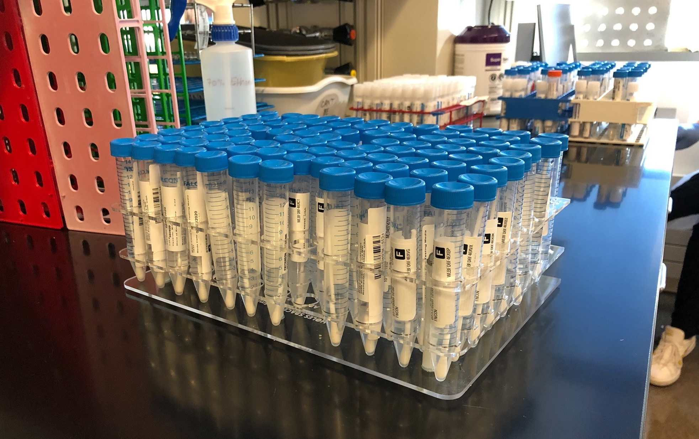
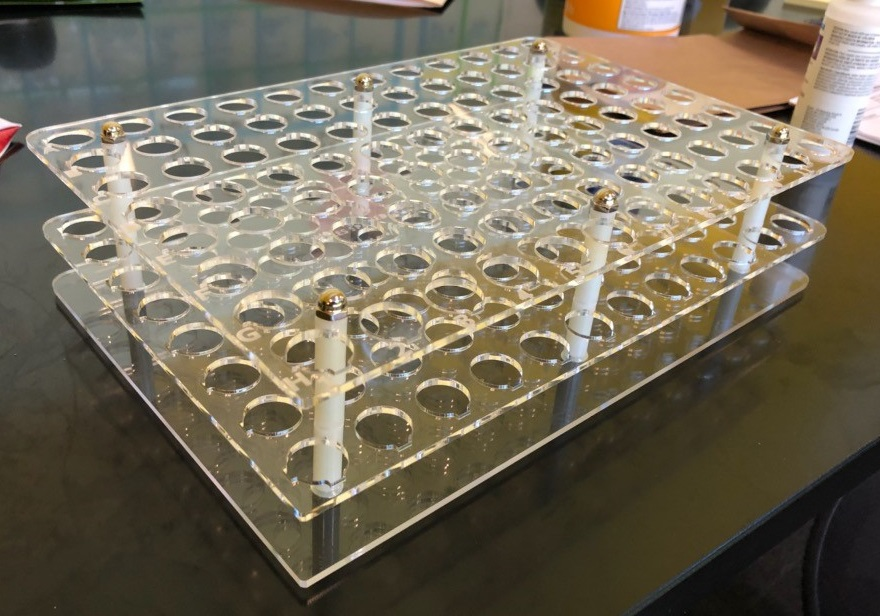
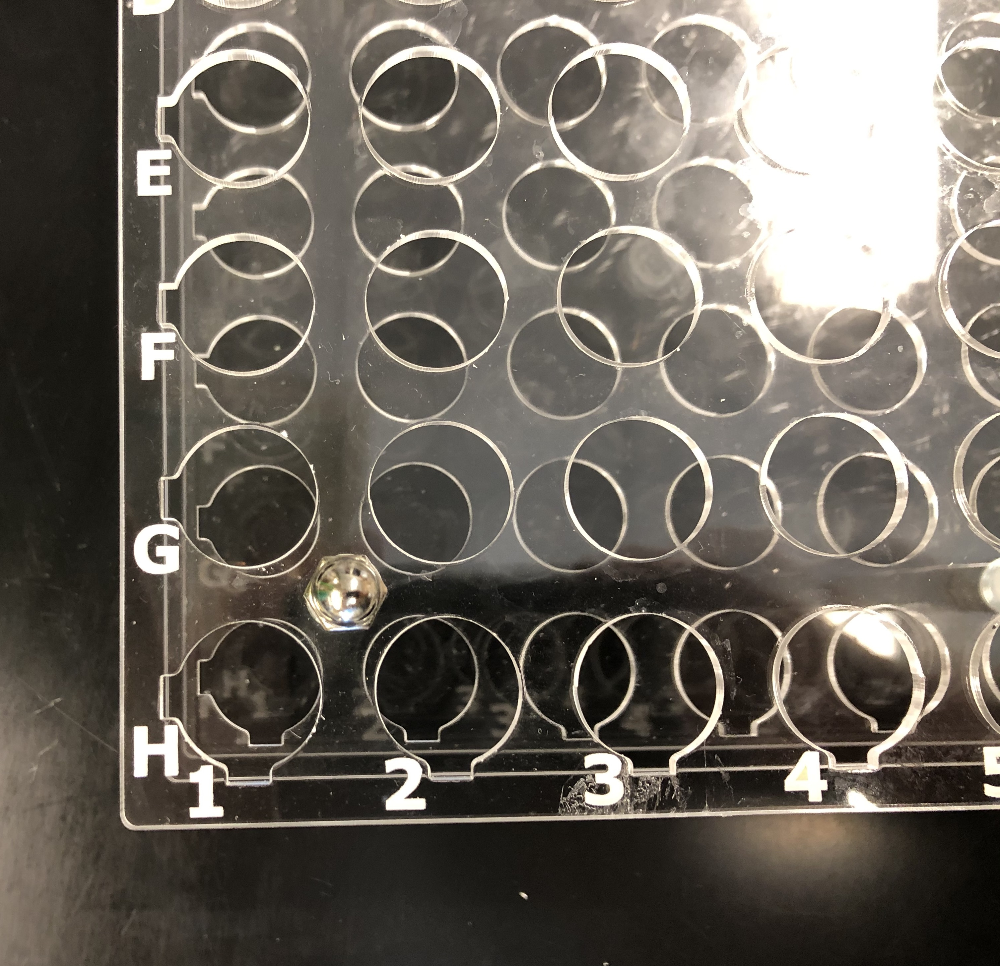
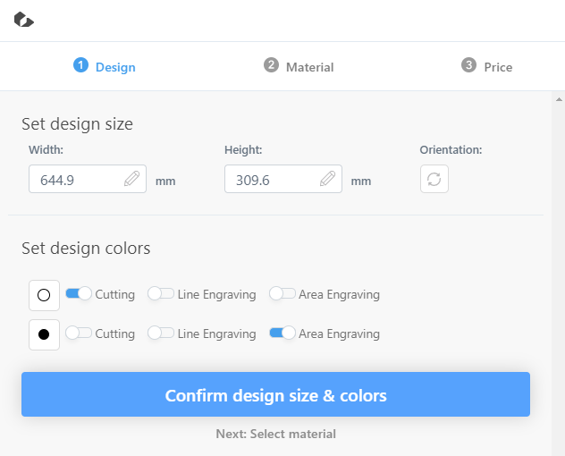

# Open Source Tube Rack

###### Please read the included `LICENSE` file before starting this project
## Description
An open source test tube rack design made for ~15mm to ~17.5mm diameter test tubes commonly used for coronavirus testing. This repository is meant to be a hub for source files, documentation, and improvements to be made. Refer to [Ordering Parts](#ordering-parts) and [Assembly](#assembly-instructions) for further instructions.

This design is meant to replace commonly used snap-together test tube racks like [these](https://image.made-in-china.com/2f0j00ligULfpcqukB/Snap-Together-Test-Tube-Racks-with-90-Wells.jpg). Although this laser-cut acrylic design is larger than snap-together tube racks for similar size tubes, it has several key improvements:
* Uses a 96-well format, which interfaces better with other lab equipment and is a more common layout. 
* Larger spacing between test tubes means they are easy to grab, even in the middle of the rack.
* Engraved row and column lettering helps with indexing the test tubes, and is much larger and easier to see than the tiny "embossed" lettering on common 60 or 90-place snap-together racks.

## Ordering Parts

The first step to ordering parts is filling out a proper bill of materials. Provided [here](https://docs.google.com/spreadsheets/d/1J19slEzeszxZjY6wbKE6jNVbN__mE522mNdJpSvLzcY/copy) is an auto-updating spreadsheet, which can be modified for any quantity of racks:
1. Make a copy of the spreadsheet so you can make modifications.
1. Change the "**Number of Racks**" to the desired quantity.
1. Find the laser cutting cost by going to the [Ponoko website](https://www.ponoko.com/designs). For the rest of these steps, make sure you have "millimeters" selected at the bottom of the Ponoko webpage (scroll to the very bottom - the button is good at hiding).
    1. Upload the file `tube-rack-vector-sheet.svg` to that website (loading may take a few minutes)
    1. Change the "Height" of the design to `644.9mm` and then click the "Orientation" button so the design fits horizontally. Sometimes the website will change the design size to something a bit smaller or larger, so *ensure that the overall size is `644.9mm` wide by `309.6mm` long.* It should look like this:  
    1. Confirm the design size and continue to material selection. This is technically up to you, but **in order for the engraved labels to show through, the material chosen needs to be very translucent or just transparent.** Normal "Clear Acrylic" works well for this. **Make sure you select a 3mm thick material, other thicknesses may not work with the bolt lengths.**
    1. Enter your desired quantitiy. For example, 100 racks would mean 100 sheets, that cost `$24.78` each. The cost you get (per rack) for this is what you should use in step 4.

1. Change **G11** to the estimate you recieved from the Ponoko website (per rack, not the total). The bill of materials should now be fully updated.

Shipping and tax is not included in this estimate, since that will vary based on other factors. Once you have the bill of materials, you can order parts. **Note that the laser cut sheets may take a long time to be cut if you are ordering large quantities** (over 50 tube racks, for example), so make sure to take that into consideration before ordering anything.

## Assembly Instructions
Once you have all the parts, assembly should be a straightforward (although sometimes time consuming) process. The [assembly manual](assembly-manual-LATEST.pdf) is the current source of instructions. Everything you should need to know about making these (including a list of helpful tools and tricks for making assembly faster) will be in there.

## Further Questions / Contributing
Anyone is welcome to contribute to this project. *If you have a different design idea or have photos of completed tube racks to add to this repository, please reach out to [the creator](https://github.com/aaronbeckman) of this project.*

If you have further questions, please [create an issue](https://github.com/aaronbeckman/open-source-tube-rack/issues) with a clear description on what should be improved or added to the design, documentation, etc.
